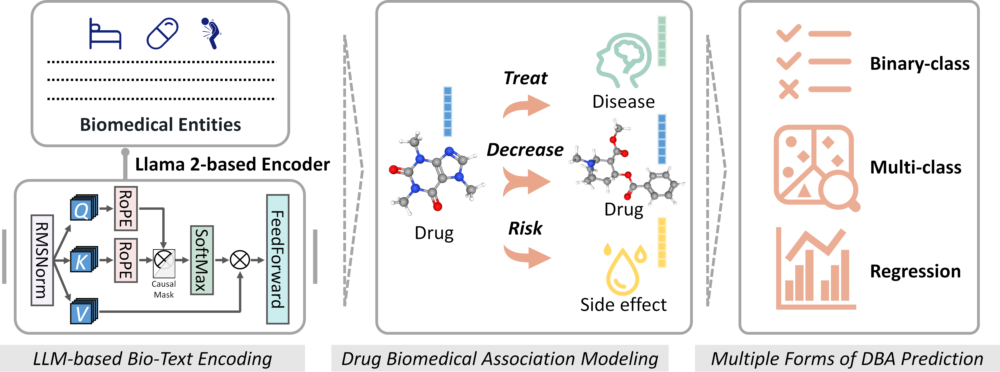

# <u>L</u>arge Language Model-Based Natural Language <u>E</u>ncoding Could Be All You Need for <u>D</u>rug Biomedical <u>A</u>ssociation <u>P</u>rediction

##### Hanyu Zhang, Yuan Zhou, Zhichao Zhang, Huaicheng Sun, Ziqi Pan, Minjie Mou, Wei Zhang, Qing Ye, Tingjun Hou, Honglin Li<sup> * </sup>, Chang-Yu Hsieh<sup> * </sup> and Feng Zhu<sup> * </sup>


## Graphical Abstract

 


## Dependencies

- LEDAP should be deployed on Linux in python 3.8.
- Main requirements: `python==3.8.8`, `pytorch==1.10.1`, `xgboost 2.0.3`, `scikit-learn==0.24.1`, `optuna 2.10.0`.
- `requirements.txt` is provided for environment dependency installation by `pip install -r requirements.txt`.
- To use GPU, please install the GPU version of  `pytorch`.


## Install

1. Download source codes of LEDAP.
2. LEDAP should be deployed on Linux.
3. The LEDAP tree includes directories as follows:

```
 |- DDA
    |- bashes
    |- data
    |- rf
 |- DDI
    |- bashes
    |- data
    |- xbgoost
 |- DSA
    |- bashes
    |- data
    |- xbgoost
 |- paper
    |- materials
 |- representations
    |- llama_2-7b
 |- README.md
 |- requirements.txt
 |- LICENSE
```


## Usage

#### 1. Prepare feature representation for bio-entities using Large Language Models (Llama 2 in this study)

##### 1.1 Collect textual descriptions according to the respective requirements

##### 1.2 Conduct bio-text preprocessing and feature transformation following the [Llama 2 Release](https://github.com/Meta-Llama/llama)

##### 1.3 Place the representation data into the `./representaions/llama_2-7b/` imitating the examples. 

__Note:__ the prepared LLM-based representations used in this study were available on ~~[Google Drive](https://drive.google.com/drive/folders/1Xym2iMiKDzOgwPUQRSrOcTdbri9eZG7u?usp=drive_link)~~. ^ The associated account has been unexpectedly deactivated by Google, we are now working to fix the issue, PLEASE WAITING…. ^

#### 2. Use LLM-based representations to analyze drug biomedical associations

##### 2.1 Switch to the target path the user wants to investigate (`cd ./DDA` for drug-disease association, `cd ./DDI` for drug-drug interaction, `cd ./DSA` for drug-side effect association). Or construct a new path for additional research imitating the examples.

##### 2.2 Place the predicting data that users want to investigate into the `./data` imitating the examples.

##### 2.3 Switch to the directory of `./bashes` and modify the bash files according to the recorded guidance, then execute the following commands :

```
sh run.sh	# Run the model for DBA prediction
```


## Citation and Disclaimer

The manuscript is currently online ahead of print by *__Analytical Chemistry__*.

DOI: [10.1021/acs.analchem.4c01793](https://doi.org/10.1021/acs.analchem.4c01793)

Should you have any questions, please contact Dr. Zhang at hanyu_zhang@zju.edu.cn

